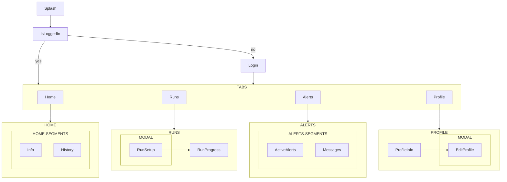

# App Databús

Descripción de la aplicación móvil operativa del transporte público compatible con Databús®.

> Aplicación móvil operativa para choferes y despachadores de los vehículos de transporte público, para la recolección de datos de rastreo y telemetría en tiempo real de los viajes (carreras).

## Referencias

(Trabajo en progreso)

- [Figma](https://www.figma.com/proto/ycNjVgCw07pfJcLdXdWEeK/bUCR?node-id=91-1859&t=x2cUCvlbCoUTnBEd-1): Prototipo de la aplicación móvil
- [Google Sheets](https://docs.google.com/spreadsheets/d/1fmHEGEc7xYAvA4p_RRfGVPQrZNYWkDINNFxcZWkvaqI/edit?usp=sharing): Acciones y _endpoints_ de la API
- [Databús API](https://databus.bucr.digital/api/docs/): Documentación de la API de Databús

## Algo aquí

