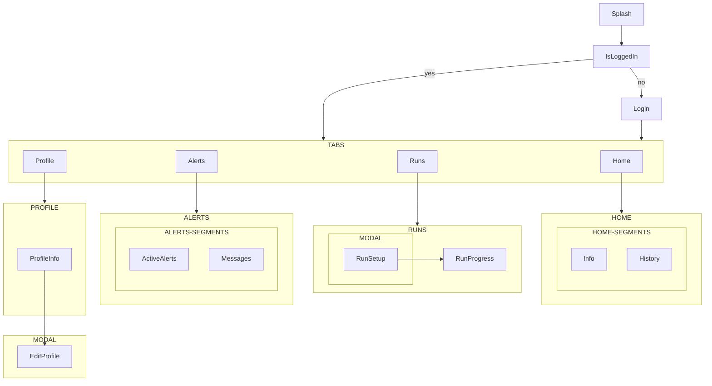

# Operational Mobile App

Cross-platform mobile application for bus drivers, trip dispatchers and fleet operators to collect real-time vehicle telemetry, GPS tracking, and operational events.

## References

(Work in progress)

- [Figma](https://www.figma.com/proto/ycNjVgCw07pfJcLdXdWEeK/bUCR?node-id=91-1859&t=x2cUCvlbCoUTnBEd-1): Prototipo de la aplicación móvil
- [Google Sheets](https://docs.google.com/spreadsheets/d/1fmHEGEc7xYAvA4p_RRfGVPQrZNYWkDINNFxcZWkvaqI/edit?usp=sharing): Acciones y _endpoints_ de la API
- [Databús API](https://databus.bucr.digital/api/docs/): Documentación de la API de Databús

## Architecture (sketch)


```mermaid
flowchart TD
  Splash
  IsLoggedIn
  Login
  subgraph TABS
    Home
    Runs
    Alerts
    Profile
  end
  subgraph HOME
    subgraph HOME-SEGMENTS
      Info
      History
    end
  end
  subgraph RUNS
    subgraph MODAL
      RunSetup
    end
    RunProgress
  end
  subgraph ALERTS
    subgraph ALERTS-SEGMENTS
      ActiveAlerts
      Messages
    end
  end
  subgraph PROFILE
    ProfileInfo
  end
  subgraph PM[MODAL]
    EditProfile
  end

  Splash --> IsLoggedIn
  IsLoggedIn --"yes"--> TABS
  IsLoggedIn --"no"--> Login
  Login --> TABS

  Home --> HOME
  Runs --> RUNS
  Alerts --> ALERTS
  Profile --> PROFILE

  RunSetup --> RunProgress
  ProfileInfo --> EditProfile
```

## How to
This section explains how to install Node/npm on a Linux machine, install the project dependencies and run the app during.

### 1) Install Node.js and npm

Linux 
```bash
sudo apt-get install -y nodejs npm
node -v
npm -v
```

MacOS
```bash
brew update
brew install node
node -v
npm -v
```

Windows 
```bash
Download the official installer from the Node.js website.

Run the installer and follow the setup steps.

node -v
npm -v
```

### 2) Install project dependencies
Open a terminal at the project app folder and install packages:

```bash
cd /path/to/databus-app/app
npm install
```

### 3) Run the dev server

```bash
npm run dev
```

### 4) Build project

```bash
npm run build
```