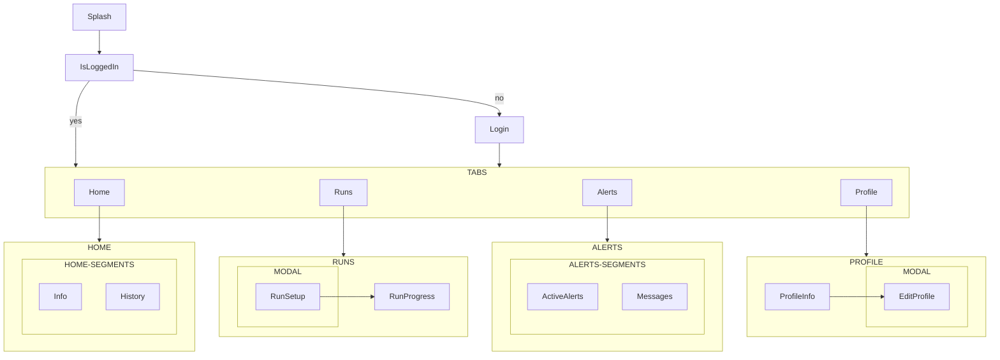

# Operational Mobile App

Cross-platform mobile application for bus drivers, trip dispatchers and fleet operators to collect real-time vehicle telemetry, GPS tracking, and operational events.

## References

(Work in progress)

- [Figma](https://www.figma.com/proto/ycNjVgCw07pfJcLdXdWEeK/bUCR?node-id=91-1859&t=x2cUCvlbCoUTnBEd-1): Prototipo de la aplicación móvil
- [Google Sheets](https://docs.google.com/spreadsheets/d/1fmHEGEc7xYAvA4p_RRfGVPQrZNYWkDINNFxcZWkvaqI/edit?usp=sharing): Acciones y _endpoints_ de la API
- [Databús API](https://databus.bucr.digital/api/docs/): Documentación de la API de Databús

## Algo aquí

```mermaid
flowchart TD
  Splash
  IsLoggedIn
  Login
  subgraph TABS
    Home
    Runs
    Alerts
    Profile
  end
  subgraph HOME
    subgraph HOME-SEGMENTS
      Info
      History
    end
  end
  subgraph RUNS
    subgraph MODAL
      RunSetup
    end
    RunProgress
  end
  subgraph ALERTS
    subgraph ALERTS-SEGMENTS
      ActiveAlerts
      Messages
    end
  end
  subgraph PROFILE
    ProfileInfo
subgraph PM[MODAL]
EditProfile
end
  end

  Splash --> IsLoggedIn
  IsLoggedIn --"yes"--> TABS
  IsLoggedIn --"no"--> Login
  Login --> TABS

  Home --> HOME
  Runs --> RUNS
  Alerts --> ALERTS
  Profile --> PROFILE

  RunSetup --> RunProgress
ProfileInfo --> EditProfile
```
