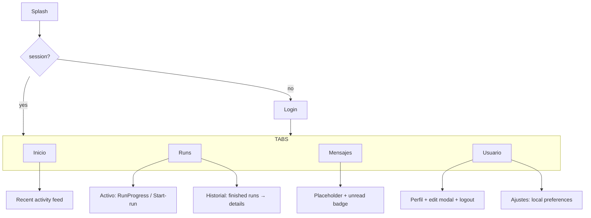

# Databús — Operational Mobile App

Cross-platform operator/on-board client for the **Databús** transit system
(UCR / SIMOVI). Bus drivers and fleet operators use it to start and end runs,
stream real-time GPS telemetry, and (later) receive operational messages and
raise service alerts.

The app is **two things at once**:

- **A mobile UI** that talks to the Databús orchestrator over a REST API — the
  low-frequency **"warm path"** (login, start/end run, lifecycle events).
- **An MQTT telemetry publisher** that streams GPS fixes to the Databús
  telemetry broker — the high-frequency **"hot path"** (position updates).

It has **no backend of its own**. Every server-side concern lives in sibling
repositories (see [System context](#system-context)).

## References

- [Figma](https://www.figma.com/proto/ycNjVgCw07pfJcLdXdWEeK/bUCR?node-id=91-1859&t=x2cUCvlbCoUTnBEd-1): app prototype
- [Google Sheets](https://docs.google.com/spreadsheets/d/1fmHEGEc7xYAvA4p_RRfGVPQrZNYWkDINNFxcZWkvaqI/edit?usp=sharing): API actions & endpoints
- [Databús API docs](https://databus.bucr.digital/api/docs/)
- [`SITEMAP.md`](./SITEMAP.md): navigation & screen specification
- [`plans/master-plan.md`](./plans/master-plan.md): the authoritative build spec
- [`DATABUS_INTEGRATION.md`](./DATABUS_INTEGRATION.md): the backend-facing
  contract & open asks for the Databús team

---

## System context

```
┌─────────────────────────┐         warm path (REST/HTTPS)        ┌──────────────────────────┐
│   databus-app (THIS)     │  ───────────────────────────────────▶ │   databus (orchestrator) │
│   Ionic Vue + Capacitor  │      login, create/confirm/end run     │   Django + DRF           │
│                          │                                        │   run-lifecycle FSM      │
│  ┌────────────────────┐  │         hot path (MQTT)                │   Redis · RabbitMQ ·     │
│  │ TelemetryRuntime   │  │  ───────────────────────────────────▶ │   Celery · GTFS          │
│  └────────────────────┘  │      transit/vehicle/<id>/position     └──────────────────────────┘
└─────────────────────────┘                                         ┌──────────────────────────┐
                                                                    │   telemetry broker       │
                                                                    │   NanoMQ (MQTT)          │
                                                                    └──────────────────────────┘
```

Sibling repositories (expected as siblings of this repo):

| Repo | Role |
|---|---|
| `../databus` | Django/DRF orchestrator, NanoMQ broker, Redis, RabbitMQ, Celery, the run-lifecycle FSM, GTFS Schedule + Realtime. **All backend behavior lives here.** |
| `../databus-sim` | A fleet simulator that drives runs and publishes GTFS-Realtime telemetry — the primary way to exercise the full run lifecycle in dev. |
| `../context` | System documentation. |

---

## Tech stack

- **Ionic Vue 8** + **Vue 3** (Composition API, `<script setup lang="ts">`) + **Vite**
- **Capacitor 8** — native shell (Android/iOS) + plugins (Geolocation, Preferences)
- **Pinia** (setup stores) · **Vue Router** (Ionic router)
- **mqtt.js** (WebSocket) for the web/dev telemetry transport
- **Custom Capacitor plugin** (`app/plugins/capacitor-databus-telemetry/`) for
  the native production transport — Kotlin (Android) + Swift (iOS): TCP+TLS
  MQTT, foreground service, background location, native store-and-forward.

---

## How it works

### Screens & navigation

The four bottom tabs follow [`SITEMAP.md`](./SITEMAP.md):


```mermaid
flowchart TD
  Splash --> IsLoggedIn{session?}
  IsLoggedIn --"yes"--> TABS
  IsLoggedIn --"no"--> Login --> TABS
  subgraph TABS
    Inicio
    Runs
    Mensajes
    Usuario
  end
  Inicio --> Recent[Recent activity feed]
  Runs --> Activo[Activo: RunProgress / Start-run]
  Runs --> Historial[Historial: finished runs → details]
  Mensajes --> Placeholder[Placeholder + unread badge]
  Usuario --> Perfil[Perfil + edit modal + logout]
  Usuario --> Ajustes[Ajustes: local preferences]
```

- **Inicio** — greeting + active-run card + recent-activity feed (last 3 runs).
- **Runs** — `Activo` (current run or start-run CTA) / `Historial` (finished
  runs, each opening a details modal with the live FSM timeline).
- **Mensajes** — placeholder; no messaging backend yet (badge is wired for when
  one exists).
- **Usuario** — `Perfil` (institutional identity + edit modal + logout) /
  `Ajustes` (device-local preferences).

### The run lifecycle

Starting a run is a two-call REST sequence, after which the run store owns
telemetry:

```
create-run  ──▶ POST /api/create-run/                 → Initialized
confirm     ──▶ POST /api/runs/<id>/update/           → Confirmed
                { event: run_confirmed_by_operator }
              (telemetry.start() fires here, fire-and-forget)

… server advances Confirmed → Tracking → In Progress as GPS arrives …

end run     ──▶ POST /api/runs/<id>/update/
                { event: <run_interrupted | cancel_run>,
                  details: { actor_role: "operator" } }
              (telemetry.stop(); run recorded to local history)
```

Key rules learned from the backend FSM (see `DATABUS_INTEGRATION.md` for the
full detail):

- **A GTFS trip already carries `route_id`, `direction_id` and `shape_id`.** The
  run wizard is `route → trip → vehicle`; there is **no** separate "direction"
  step. Trips come from `GET /api/trips/?route_id=`.
- **The operator cannot send `run_completed`.** That is the *system's*
  terminal-stop event (fired by the realtime engine at the trip terminal). The
  operator's manual "End run" sends `run_interrupted` (when the bus is already
  under way) or `cancel_run` (before it moves), each with
  `details.actor_role="operator"`. Because a run can finish without an operator
  action, the app records history whenever it **observes** any terminal state
  (`Completed`/`Cancelled`/`Interrupted`/`Short Turned`) — via the manual end
  *or* via the ~5s state poll — so system-completed runs still appear in history.
- **One active run per operator.** The backend binds an operator/vehicle/trip to
  a run until it reaches a terminal state; a second create-run for the same
  operator is rejected. The app surfaces the backend's real reason.

### Telemetry seam (dev vs prod)

`TelemetryRuntime` is one interface with two implementations, chosen at runtime
by `Capacitor.isNativePlatform()`:

| | **Web / dev runtime** | **Native / prod runtime** |
|---|---|---|
| Transport | mqtt.js over **WebSocket** | **raw TCP + TLS** via the native plugin |
| Broker | `ws://…:8083/mqtt` (dev listener) | `mqtts://<host>:8883` |
| GPS | browser `navigator.geolocation` | native background location |
| Buffering | in-memory queue | native store-and-forward across cellular gaps |
| Backgrounding | tied to the tab | foreground service, survives lock/background |

**This split is deliberate — see [Testing: dev vs prod](#testing-dev-vs-prod).**

### Persistence

The app persists three things to `@capacitor/preferences` (localStorage on web,
OS-backed storage on native):

- **Session** (`databus.session`) — token + operator identity.
- **Run history** (`databus.runHistory`) — an append-only log of finished runs.
  The backend has **no run-list endpoint**, so the app keeps its own. On
  entering the Runs tab it `reconcile()`s the log against
  `GET /runs/<id>/state/`: entries whose run 404s are pruned, survivors have
  their final state refreshed. History therefore only shows runs that still
  exist in the DB.
- **Settings** (`databus.settings`) — device-local preferences (display-name
  override, background-telemetry / keep-screen-on toggles, language, and the
  chosen color palette).

Stores are rehydrated in `main.ts` **before the router is installed**, so a cold
start (native) or refresh (web) restores the session before the auth guard runs.

> **Known gap:** the *active* run lives only in memory. After a web refresh (or
> if the OS kills a backgrounded native app mid-run) the Runs tab shows "no
> active run" even though it is live server-side. Resuming it needs a backend
> "operator's current run" endpoint — see `DATABUS_INTEGRATION.md`.

### Theming & color palettes

The operator can recolor the whole app from **Usuario → Ajustes → Tema**. A
palette is just 3 brand colors plus a light/dark page background, defined in
`src/theme/palettes.ts`:

```ts
{ id: 'ocean', name: 'Océano',
  primary: '#0a84ff', secondary: '#0b1f33', tertiary: '#30c8c9',
  background: '#eef4fb', backgroundDark: '#0a1420' }
```

That's all you author — `src/theme/applyPalette.ts` derives the full set of
Ionic CSS variables (`-rgb` / `-contrast` / `-shade` / `-tint` for each stepped
color, using Ionic's own formulas) plus the surrounding surface tokens
(item / card / toolbar / tab-bar backgrounds and text color) from the chosen
background, and writes them onto `:root` at runtime — so a palette recolors the
app with **no rebuild**. The pick is persisted in settings, applied on boot
before first paint, and re-applied live when the OS light/dark preference
changes. **To add a palette, append one entry to `PALETTES`** — nothing else.

### Branding

The Databús wordmark and "b" mark live in `public/logo/`. `BrandLogo.vue`
renders the wordmark with `dark` / `light` / `auto` variants (auto follows the
OS color scheme so it stays legible on themed surfaces); it's used on the
Splash, Login and Home screens. The "b" mark is the favicon and iOS touch icon.

---

## Getting started

### Prerequisites

- Node 20+ and npm
- The **`../databus`** stack running (orchestrator on `:8000`, telemetry broker
  reachable) — see that repo's README.
- Optionally **`../databus-sim`** to drive runs through the full lifecycle.

### Install & configure

```bash
cd app
npm install
cp .env.example .env      # defaults are correct for local dev
```

`.env` (dev defaults):

```dotenv
VITE_API_BASE_URL=/api                 # relative → Vite proxies to :8000 (avoids CORS)
VITE_MQTT_URL=ws://localhost:8083/mqtt # dev-only MQTT-over-WebSocket listener
```

### Run the app

```bash
npm run dev                # Vite dev server, default http://localhost:5173
```

> **Port note:** Vite uses **5173** by default and **auto-increments** (5174,
> 5175 …) if it's taken. If you see the app on an unexpected port, a stale
> `npm run dev` (or an old git *worktree*) is still holding 5173. Kill stray
> `vite` processes (`pkill -f vite`) for a single source of truth, or pin one
> with `npm run dev -- --port 5173 --strictPort`.

Sign in with the dev demo operator (seeded in `../databus` — see that repo):

```
usuario:    demo
contraseña: demo12345
```

### Native builds

```bash
npm run build
npx cap sync                 # sync web assets + plugins into native projects
npx cap open android         # or: npx cap open ios
```

The native telemetry broker host is configured in
`app/capacitor.config.ts` under `plugins.DatabusTelemetry` (`brokerHost`,
`brokerPort: 8883`, `useTls: true`). Credentials are **never** committed there —
they are injected per-call. The placeholder host must be set by ops before a
real native build (see `DATABUS_INTEGRATION.md`).

---

## Testing

```bash
cd app
npm run lint          # eslint
npm run test:unit     # vitest (unit) — use `npx vitest run` for a single pass
npm run build         # vue-tsc typecheck + vite build
npm run test:e2e      # cypress (e2e) — needs the dev server running
```

Current status: **lint clean · 90 unit tests · typecheck + build green.**

### Testing the full run lifecycle

Unit/e2e tests mock the backend. To exercise the **real** lifecycle
(Confirmed → Tracking → In Progress → terminal), run against **`../databus-sim`**,
which publishes GTFS-Realtime telemetry that drives the FSM forward — the app
then shows the states advancing live.

### <a id="testing-dev-vs-prod"></a>Testing: dev vs prod

The transport differs by environment **by design**, and the two paths exercise
different code:

| | **Development** | **Production** |
|---|---|---|
| **API** | `http://localhost:8000`, reached via the **Vite dev proxy** at `/api` (sidesteps CORS — the backend has no `django-cors-headers`) | `https://<api-domain>` on **443 / TLS** |
| **Telemetry** | **MQTT over WebSocket** (`ws://…:8083/mqtt`) using **mqtt.js**, in the browser | **raw MQTT over TCP + TLS** on **8883**, via the **native Capacitor plugin** — prod exposes *no* WebSocket listener |
| **GPS** | browser geolocation (foreground only) | native background location + foreground service |
| **Buffering** | in-memory queue | native store-and-forward across cellular gaps |
| **Runtime picked** | web runtime (`createWebRuntime`) | native runtime (`createNativeRuntime`) |

Practical consequences when testing:

- In a **desktop browser** there is no MQTT WebSocket broker unless one is
  running; telemetry status shows **`buffering`**, which is expected. The run
  lifecycle (REST) still works fully.
- The **prod TCP+TLS path cannot be exercised in a browser at all** — it only
  runs on a native device build through the plugin. Validating it end-to-end
  requires a device (or emulator), the plugin's `brokerHost` set to a reachable
  broker, and the TLS trust chain + auth scheme finalized with ops (tracked in
  `DATABUS_INTEGRATION.md`).

---

## Project layout

```
app/
  src/
    views/            # one page per screen (Splash, Login, Home, Runs, Messages, User…)
    components/
      trips/          # TripSetupModal (run wizard), RunProgress
      runs/           # RunHistoryList, RunDetailsModal
      user/           # ProfileEditModal
      ui/             # AppError, AppLoading, EmptyState, BrandLogo
    stores/           # Pinia: auth, run, runHistory, settings
    services/
      apiClient.ts    # typed fetch wrapper (Token auth, error envelopes)
      schedule.ts     # GTFS/run REST lookups
      geolocation.ts  # GPS watcher (Capacitor native / browser fallback)
      telemetry/      # TelemetryRuntime seam + web & native implementations
    theme/            # variables.css + palettes.ts + applyPalette.ts (theming)
    types/            # api.ts (wire types), domain.ts (app types)
    router/           # routes + auth guard
  public/
    logo/             # Databús wordmark (dark/light) + "b" mark; favicon
  plugins/
    capacitor-databus-telemetry/   # native TCP+TLS MQTT plugin (Kotlin + Swift)
  tests/
    unit/             # vitest
    e2e/              # cypress
plans/                # master-plan.md + per-agent briefs
SITEMAP.md            # navigation spec
DATABUS_INTEGRATION.md# backend contract + open asks for the databus team
```

---

## What's left to do

**App-side**

- [ ] **Resume active run on boot** — rehydrate `activeRun` from the backend
      (needs the "operator's current run" endpoint below).
- [ ] **Messages tab** — real operator messaging (chat/announcements) once a
      backend exists.
- [ ] **Alerts** — GTFS-Realtime service-alert creation (intentionally out of
      scope for this milestone).
- [ ] **Native device validation (M-native)** — build on device, exercise the
      TCP+TLS + background + store-and-forward path end-to-end.
- [ ] **i18n** — the language setting is persisted but not yet wired: UI strings
      are hard-coded Spanish and not extracted, so changing it has no effect yet.

**Needs the Databús team** (details + rationale in
[`DATABUS_INTEGRATION.md`](./DATABUS_INTEGRATION.md))

- [ ] `GET` endpoint for an operator's **current active run** (Redis binding
      exists; no REST exposure yet).
- [ ] A **run-list / run-history** endpoint (the DRF run ViewSet is commented
      out), so history isn't purely client-side.
- [ ] **Cancel-from-Initialized** FSM transition (a run stuck in `Initialized`
      cannot currently be cancelled).
- [ ] **Broker TLS trust chain + auth scheme** for the native prod transport,
      and a **staging broker host**.
- [ ] Optionally, **CORS** for the web build so it can talk to the API without
      the dev proxy.

---

## Conventions

- Small, focused files; immutable store updates; explicit error handling at
  system boundaries (see the repo's coding rules).
- Wire types (`types/api.ts`) are verified against
  `../databus/backend/api/{urls,views,serializers}.py`; changes there should be
  reflected here.
- `plans/master-plan.md` §6 holds the frozen contracts (store/service
  signatures, telemetry seam, MQTT payload). Update it in the same change if a
  contract moves.
