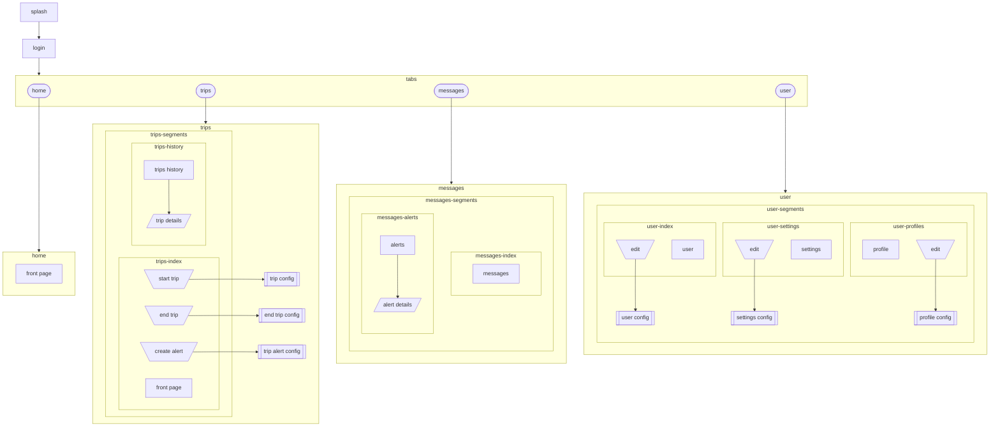
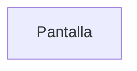
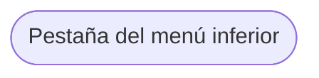
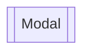
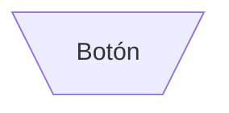
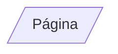

# Mapa del sitio

## Objetivos principales

1. Dispositivo de localización para rastreo y telemetría de vehículos (podría funcionar como _gateway_ de otros sensores en el futuro)

- Interfaz para despachadores y administradores de flotas

1. Aplicación operativa (mensajería, reportes, alertas, comunicación interna)

## Canales y protocolos de comunicación

- Wi-Fi
- Bluetooth
- Red celular

### Protocolos de comunicación

- HTTP (REST/GraphQL API): eventos esporádicos (inicio de un viaje, una alerta, etc.): _warm path_
- TCP (MQTT): actualizaciones de alta frecuencia (rastreo y telemetría): _hot path_

- Intermediador: tcp://mqtt.simovi.org:1883 (tcp://mqtt.databus.ucr.ac.cr:1883)

La aplicación es dos cosas:

- Aplicación móvil (interfaz con conexión a API)
- Cliente MQTT (_publisher_)

- `Splash`: logo, versión, etc.
- `Login`: credenciales (usuario, contraseña, recuperar contraseña)
- `Home`: bitácora de viajes realizados, tipo "front-page" con los últimos viajes, las últimas alertas, los últimos mensajes (cuando dice "Ver más")
- `Trip`:
  - Sin un viaje en progreso: información general, botón de iniciar viaje (`Trip Config`), botón de alertas (`Trip Alerts`)
  - Con un viaje en progreso: datos del viaje, botón de alertas (`Trip Alerts`), botón de finalizar viaje (`End Trip`)
- `Messages`: chat, anuncios, mensajería operativa en general
- `Profile`: perfil
- `Settings`: ajustes de la aplicación

## "Reglas" de uso

- Cada espacio de edición es un modal (demanda edición y guardar y cancelar)
- Tabs y segments son para visualización

## Simbología

Gerardo, favor colocar links a los componentes de Ion:

## Especificaciones

Elementos de entrada/salida a utilizar: [Ionic Framework](https://ionicframework.com/docs/api/input "Lista de elementos de interfaz que posee Ionic")

- Ingreso `login`
  - [Entrada de Texto](https://ionicframework.com/docs/api/input): ID de usuario.
  - [Entrada de Texto](https://ionicframework.com/docs/api/input): Contraseña.
  - [Botón](https://ionicframework.com/docs/api/button): Enlace para recuperar la contraseña.
- Inicio `home`
  - [Lista](https://ionicframework.com/docs/api/infinite-scroll): Historial de viajes realizados.
    - [Calendario](https://ionicframework.com/docs/api/datetime): Calendario que permita filtrar el historial de viajes por un rango de fechas.
    - [Barra de Búsqueda](https://ionicframework.com/docs/api/searchbar): Entrada de texto que permita filtrar el historial de viajes por parámetros textuales.
    - [Modal](https://ionicframework.com/docs/api/modal): Modal que despliegue los detalles del viaje seleccionado.
    - [Texto](https://ionicframework.com/docs/api/content): Detalles textuales, específicos del viaje seleccionado.
  - [Barra de Navegación](https://ionicframework.com/docs/api/tabs):
    - Perfil `profile`
      - [Botón](https://ionicframework.com/docs/api/button): Botón de navegación para la vista de Perfil de Usuario.
        - [Modal](https://ionicframework.com/docs/api/modal): Modal que despliega la ventana de Perfil de Usuario.
          - [Texto](https://ionicframework.com/docs/api/content): Datos textuales del Usuario.
          - [Avatar](https://ionicframework.com/docs/api/avatar): Foto/Avatar del Usuario.
    - Viajes `trips`
      - [Botón](https://ionicframework.com/docs/api/button): Botón de navegación para la vista de Viajes.
        - [Modal](https://ionicframework.com/docs/api/modal)
          - [Entradas de Texto](https://ionicframework.com/docs/api/input): Entradas de texto para ingresar los distintos parámetros necesarios para configurar y dar inicio a un nuevo viaje.
          - [Lista](https://ionicframework.com/docs/api/menu): Lista que despliega las rutas disponibles que puede seleccionar el usuario.
          - [Botón](https://ionicframework.com/docs/api/button): Botón de confirmación para comenzar un nuevo viaje.
        - [Modal (alternativo)](https://ionicframework.com/docs/api/modal): En caso de existir un viaje actualmente en progreso.
          - [Texto](https://ionicframework.com/docs/api/content): Detalles textuales del viaje en progreso.
          - [Botón](https://ionicframework.com/docs/api/button): Botón para crear alertas sobre el viaje en progreso.
          - [Botón](https://ionicframework.com/docs/api/button): Botón para finalizar viaje.
    - Mensajes ``
      - [Botón](https://ionicframework.com/docs/api/button): Botón de navegación para la vista de Mensajes.
        - [Notificación](https://ionicframework.com/docs/api/badge): Valor numérico en el botón que indica la presencia de notificaciones pendientes.
        - [Modal](https://ionicframework.com/docs/api/modal)
          - [Lista](https://ionicframework.com/docs/api/infinite-scroll): Lista de notificaciones/mensajes recientes.

## Acciones

1. Crear cuenta de usuario

- No tiene permisos de nada
- Entra con Apple o Google o correo electrónico (_fallback_ para usar las mismas credenciales institucionales)

2. Autorización de usuario (creación de "perfil" con autorización institucional)

- Solicitar credenciales institucionales (correo electrónico o nombre de usuario y contraseña)
- Utilizar esas credenciales para hacer la autenticación con el servidor de la UCR (LDAP)
- Un perfil por cada inquilino (_tenant_)

3. Iniciar sesión

- Si es la primera vez:
  - Crear perfil institucional
- Si no es la primera vez:
  - Nada

4. Iniciar viaje

- Seleccionar ruta
- Seleccionar vehículo (pre-cargado de sesión anterior)
- Seleccionar conductor (pre-cargado de sesión anterior)
- Seleccionar tipo de viaje ([`ScheduleRelationship`](https://gtfs.org/documentation/realtime/reference/#enum-schedulerelationship_1))
- Si es `SCHEDULED`:
  - Seleccionar hora de inicio de la lista de trips.txt de GTFS Schedule
- Si es `ADDED`:
- Si es `CANCELED`:
- Si es `REPLACEMENT`:
- Si es `DUPLICATED`
- Si es `NEW`:
- Si es `DELETED`:
- Si es `UNSCHEDULED`:
  - Seleccionar hora de inicio manualmente

5. Finalizar viaje

- Si es `COMPLETED`:
  - Registrar hora de finalización (automáticamente)
- Si es `INTERRUPTED`:
  - Registrar hora de finalización (manualmente)
  - Llenar los campos necesarios para crear una GTFS Realtime Service Alert. Nota: siempre un viaje interrumpido genera una alerta de servicio.
- Si es `SHORT_TURNED`:
  - Registrar hora de finalización (manualmente)
  - (Posiblemente) Llenar los campos de un nuevo viaje.

6. Crear alerta

- Llenar los campos necesarios para crear una GTFS Realtime Service Alert.
