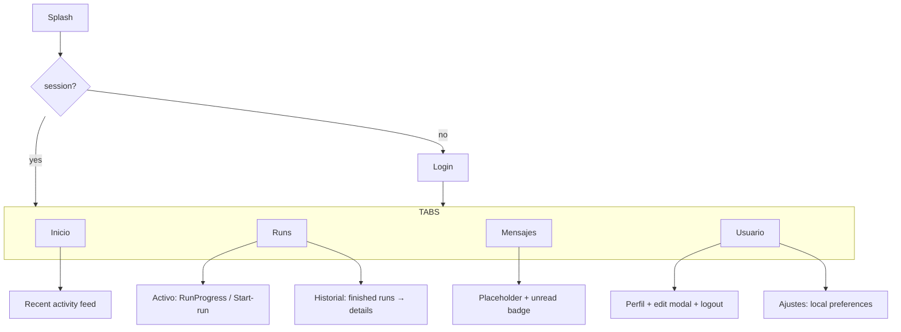

# Screens & navigation

- **Inicio** — greeting + active-run card + recent-activity feed (last 3 runs).
- **Runs** — `Activo` (current run or start-run CTA) / `Historial` (finished
  runs, each opening a details modal with the live FSM timeline). Starting a
  run opens `TripSetupModal`: a single-screen form (route → starting point →
  trip → vehicle) followed by a client-side-only review step — see
  [Trip setup & route/trip labels](../app-behavior/trip-setup-and-labels.md).
- **Mensajes** — placeholder; no messaging backend yet (badge is wired for when
  one exists).
- **Usuario** — `Perfil` (institutional identity + edit modal + logout) /
  `Ajustes` (device-local preferences).

Views live in `app/src/views/` (`SplashPage`, `LoginPage`, `HomePage`,
`RunsPage`, `MessagesPage`, `UserPage`) — see
[Project layout](project-layout.md) for the full source-tree map.
