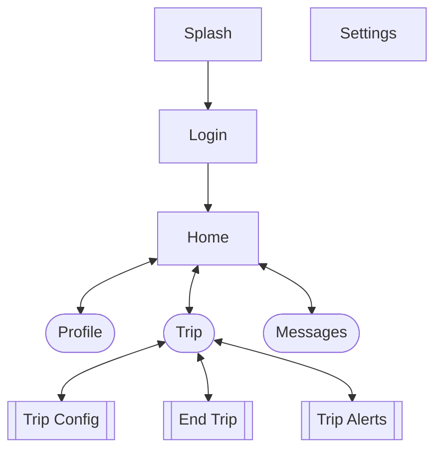
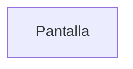
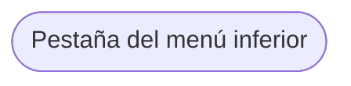
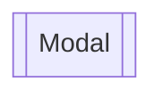

# Mapa del sitio

## Objetivos principales

1. Dispositivo de localización para rastreo y telemetría (_gateway_) de vehículos
1. Aplicación operativa (mensajería, reportes, alertas, comunicación interna)

## Canales y protocolos de comunicación

- Wi-Fi
- Bluetooth
- Red celular

- HTTP (REST/GraphQL API): eventos esporádicos (inicio de un viaje, una alerta, etc.)
- TCP (MQTT): actualizaciones de alta frecuencia (rastreo y telemetría)

- Intermediador: tcp://mqtt.simovi.org:1883 (tcp://mqtt.databus.ucr.ac.cr:1883)

La aplicación es dos cosas:

- Aplicación móvil (interfaz con conexión a API)
- Cliente MQTT (_publisher_)

- `Splash`: logo, versión, etc.
- `Login`: credenciales (usuario, contraseña, recuperar contraseña)
- `Home`: bitácora de viajes realizados
- `Trip`:
  - Sin un viaje en progreso: información general, botón de iniciar viaje (`Trip Config`), botón de alertas (`Trip Alerts`)
  - Con un viaje en progreso: datos del viaje, botón de alertas (`Trip Alerts`), botón de finalizar viaje (`End Trip`)
- `Messages`: chat, anuncios, mensajería operativa en general
- `Profile`: perfil
- `Settings`: ajustes de la aplicación

## Simbología

## Especificaciones

Elementos de entrada/salida a utilizar: [Ionic Framework](https://ionicframework.com/docs/api/input "Lista de elementos de interfaz que posee Ionic")

- `Login`
    - [Entrada de Texto](https://ionicframework.com/docs/api/input): ID de usuario.
    - [Entrada de Texto](https://ionicframework.com/docs/api/input): Contraseña.
    - [Botón](https://ionicframework.com/docs/api/button): Enlace para recuperar la contraseña.
- `Home`
    - [Lista](https://ionicframework.com/docs/api/infinite-scroll): Historial de viajes realizados.
        - [Calendario](https://ionicframework.com/docs/api/datetime): Calendario que permita filtrar el historial de viajes por un rango de fechas.
        - [Barra de Búsqueda](https://ionicframework.com/docs/api/searchbar): Entrada de texto que permita filtrar el historial de viajes por parámetros textuales.
        - [Modal](https://ionicframework.com/docs/api/modal): Modal que despliegue los detalles del viaje seleccionado.
        - [Texto](https://ionicframework.com/docs/api/content): Detalles textuales, específicos del viaje seleccionado.
    - [Barra de Navegación](https://ionicframework.com/docs/api/tabs):
        - `Perfil`
            - [Botón](https://ionicframework.com/docs/api/button): Botón de navegación para la vista de Perfil de Usuario.
                - [Modal](https://ionicframework.com/docs/api/modal): Modal que despliega la ventana de Perfil de Usuario.
                    - [Texto](https://ionicframework.com/docs/api/content): Datos textuales del Usuario.
                    - [Avatar](https://ionicframework.com/docs/api/avatar): Foto/Avatar del Usuario.
        - `Viajes`
            - [Botón](https://ionicframework.com/docs/api/button): Botón de navegación para la vista de Viajes.
                - [Modal](https://ionicframework.com/docs/api/modal)
                    - [Entradas de Texto](https://ionicframework.com/docs/api/input): Entradas de texto para ingresar los distintos parámetros necesarios para configurar y dar inicio a un nuevo viaje.
                    - [Lista](https://ionicframework.com/docs/api/menu): Lista que despliega las rutas disponibles que puede seleccionar el usuario.
                    - [Botón](https://ionicframework.com/docs/api/button): Botón de confirmación para comenzar un nuevo viaje.
                - [Modal (alternativo)](https://ionicframework.com/docs/api/modal): En caso de existir un viaje actualmente en progreso.
                    - [Texto](https://ionicframework.com/docs/api/content): Detalles textuales del viaje en progreso.
                    - [Botón](https://ionicframework.com/docs/api/button): Botón para crear alertas sobre el viaje en progreso.
                    - [Botón](https://ionicframework.com/docs/api/button): Botón para finalizar viaje.
        - `Mensajes`
            - [Botón](https://ionicframework.com/docs/api/button): Botón de navegación para la vista de Mensajes.
                - [Notificación](https://ionicframework.com/docs/api/badge): Valor numérico en el botón que indica la presencia de notificaciones pendientes.
                - [Modal](https://ionicframework.com/docs/api/modal)
                    - [Lista](https://ionicframework.com/docs/api/infinite-scroll): Lista de notificaciones/mensajes recientes.

    