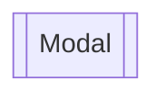

# Mapa del sitio

## Objetivos principales

1. Dispositivo de localización para rastreo y telemetría (_gateway_) de vehículos
1. Aplicación operativa (mensajería, reportes, alertas, comunicación interna)

## Canales y protocolos de comunicación

- Wi-Fi
- Bluetooth
- Red celular

- HTTP (REST/GraphQL API): eventos esporádicos (inicio de un viaje, una alerta, etc.)
- TCP (MQTT): actualizaciones de alta frecuencia (rastreo y telemetría)

- Intermediador: tcp://mqtt.simovi.org:1883 (tcp://mqtt.databus.ucr.ac.cr:1883)

La aplicación es dos cosas:

- Aplicación móvil (interfaz con conexión a API)
- Cliente MQTT (_publisher_)

- `Splash`: logo, versión, etc.
- `Login`: credenciales (usuario, contraseña, recuperar contraseña)
- `Home`: bitácora de viajes realizados
- `Trip`:
  - Sin un viaje en progreso: información general, botón de iniciar viaje (`Trip Config`), botón de alertas (`Trip Alerts`)
  - Con un viaje en progreso: datos del viaje, botón de alertas (`Trip Alerts`), botón de finalizar viaje (`End Trip`)
- `Messages`: chat, anuncios, mensajería operativa en general
- `Profile`: perfil
- `Settings`: ajustes de la aplicación

## Simbología

